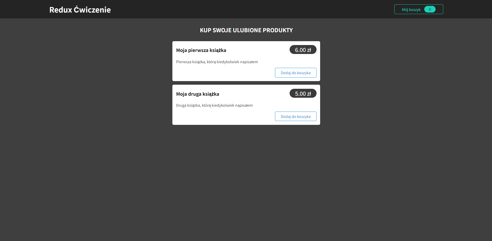
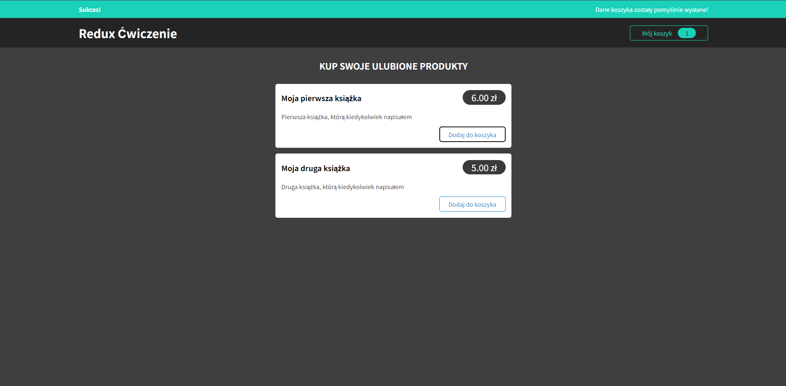
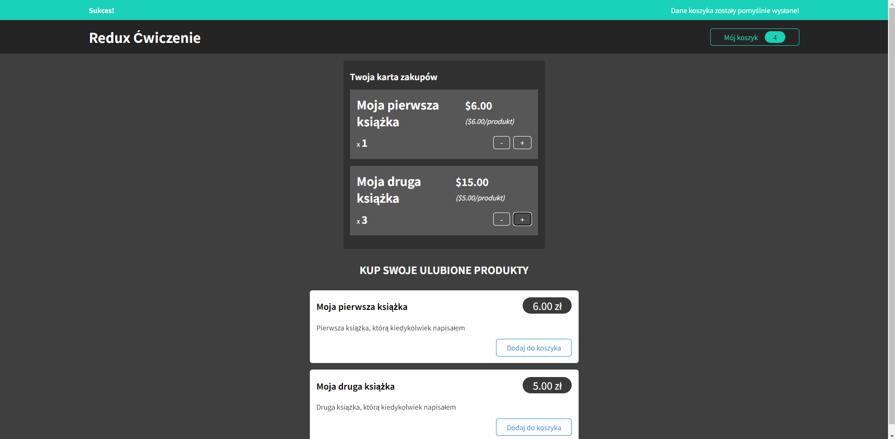

# Order management application

## Brief Description

The application was created for educational purposes to explore the implementation and use of Redux and Redux Toolkit libraries. Its main functionality is managing the state of the shopping cart, which includes operations such as adding and removing products, changing their quantity, and updating the total price. In particular, the application uses the Redux Toolkit to automate state management, eliminating the need for manual tracking of previous states through integration with the Immer library, which allows for easy manipulation of immutable data structures. Additionally, custom Redux actions have been implemented that allow for asynchronous sending and receiving of cart data from the Firebase database.

## Technologies

- React
- React Redux
- Redux Toolkit
- Asynchronous thunk actions
- Firebase
- CSS

## Features

- **Data synchronization with Firebase**: The application automatically handles the asynchronous sending and retrieving of cart data to and from the Firebase database, ensuring that the state of the shopping cart is up-to-date with the latest changes made by the user.
- **Adding products to the cart**: Users can select products and add them to a virtual shopping cart, initiating the process of managing their purchase.
- **Cart management**: This feature allows users to view the contents of their cart, adjust the quantity of individual products either by increasing or decreasing them, and immediately see the updated total price, reflecting the current selections.
- **State Updates with Redux**: By utilizing the Redux Toolkit along with the Immer library, the application streamlines the state management process. This configuration eliminates the need for manual tracking and manipulation of previous states, ensuring efficient and error-free updates to the shopping cart.
- **Handling HTTP request errors**: Implemented displaying messages that data is being sent to Firebase, that it has been successfully sent, or that there is an error with their sending. Also added error handling when retrieving data.

## App Screenshots

### Main Application Screen

### Adding a product to the cart and a status message at the top

### Displaying the cart and the ability to increase or decrease the quantity of products

## Pre-installation Requirements

A Node.js environment is required to run the application locally. To set up the project:

1. Clone the project repository.
2. Navigate to the project directory and run `npm install` to install dependencies.
3. Open a terminal window and execute `npm start` to start the frontend application in development mode
